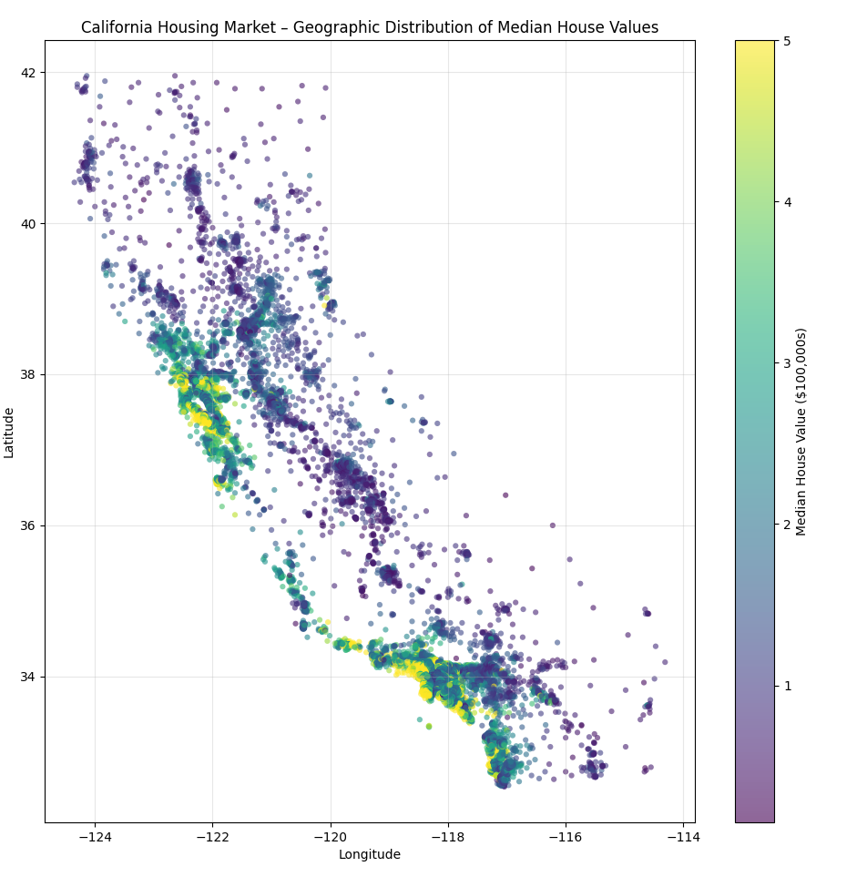

# housing-dataviz

California Housing dataset visualisation 

## Data
[Here](https://scikit-learn.org/stable/datasets/real_world.html#california-housing-dataset) you can read about California Housing dataset.

## Visualisation
`main.py` create a scatter plot of California housing locations colored by median value. 



## Running
```sh
uv run main.py
```
